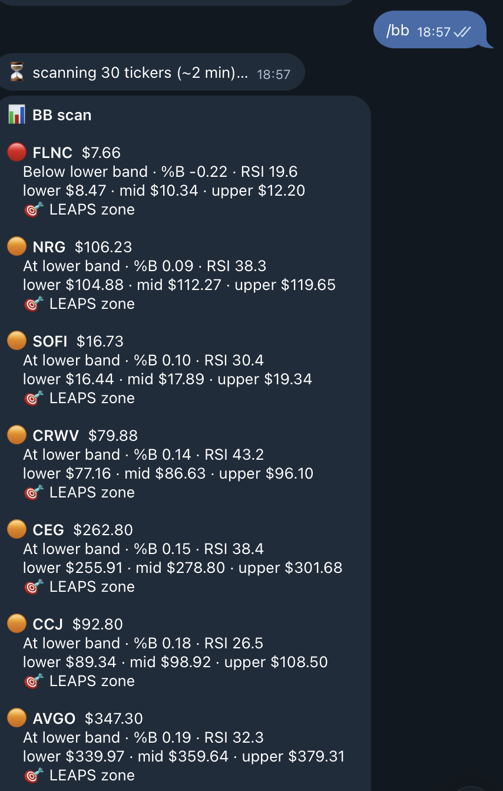
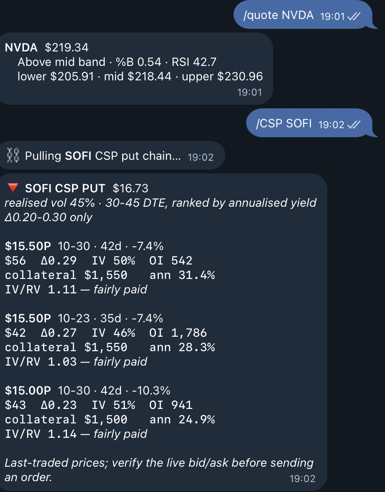
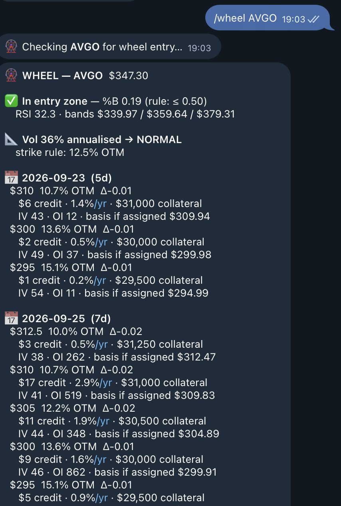
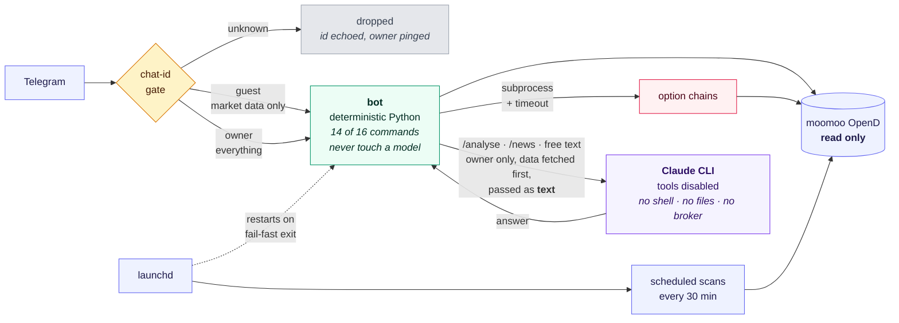
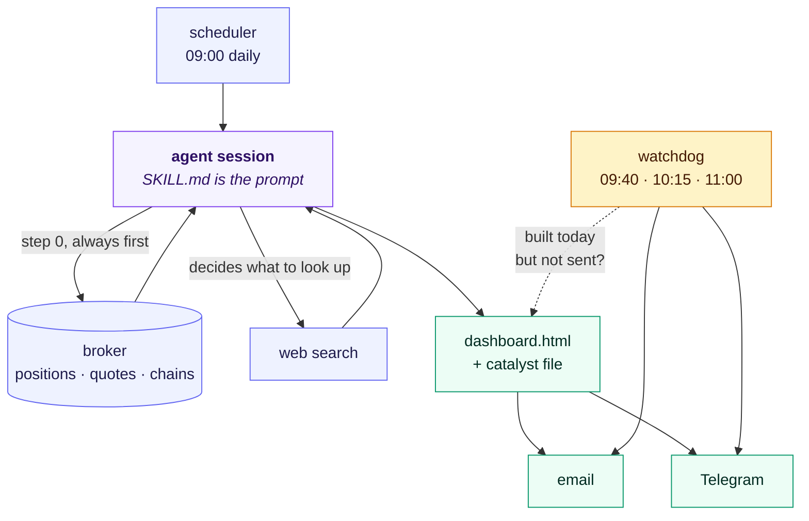

# moomoo-wheel-bot

A personal trading-automation system for an options wheel strategy: a Telegram
bot over a live brokerage account, a technical scanner across a 30-ticker
watchlist, scheduled daily reporting, and a backtesting harness.

Built for my own account against the [moomoo OpenD](https://openapi.moomoo.com/)
API. Read-only by design — **there is no order-placing code path anywhere in
this repository.**

---

## Try it without a brokerage account

Most of this needs a funded moomoo account, OpenD running locally and a
Telegram bot. Three things do not:

```bash
pip install -r requirements.txt -r requirements-dev.txt

python3 demo.py    # the strategy maths on synthetic prices — no network
pytest -q          # 26 access-control tests, 0.04s, no broker
python3 briefing/briefing_watchdog.py   # the agent's delivery check, runs anywhere
```

`demo.py` walks the entry filter, the volatility-adjusted strike rule,
Black-Scholes delta solving, and finishes on the result that killed the index
strategy — flat-IV pricing showing an $511 credit against $326 once skew is
included, which moves the breakeven win rate from 88.6% to 93.0% and the
expected value to zero.

---

## What it does

| Component | Purpose |
|---|---|
| `telegram_bot.py` | 16-command bot: positions, P&L, option chains, technicals, guest management |
| `bb_telegram_alert.py` | Bollinger/RSI scan across 30 tickers, every 30 min during market hours |
| `option_chain.py` | Chain scanner for cash-secured puts, covered calls and LEAPS |
| `spx_signal.py` | Index credit-spread entry signal with Black-Scholes strike solving |
| `wheel_analysis.py` | Entry-filter evaluation for a single ticker |
| `portfolio_telegram_briefing.py` | Daily position and risk summary |
| `briefing/` | **The agentic part** — a scheduled agent that researches, renders and delivers a daily briefing unattended |

### Bot commands

```
/portfolio /account /orders      live account (owner only)
/allow /revoke /guests           grant or remove guest access (owner only)
/quote /bb /watchlist            technicals
/csp /cc /leaps /wheel           option chains, filtered by delta and DTE
/spx                             index spread signal
/analyse /news                   research
```

---

## The strategy this automates

**The wheel** is a loop. Sell a cash-secured put on a stock you would be content
to own. If it expires worthless you keep the premium and repeat. If the stock
falls through your strike you are assigned the shares at that strike — which is
the point, not the failure — and you then sell covered calls against them until
they are called away. Then back to selling puts.

```
  sell cash-secured put ──► expires worthless ──► keep premium ──┐
           │                                                     │
           └── assigned ──► own shares ──► sell covered call ──► called away
                                 ▲               │
                                 └───────────────┘  keep premium, repeat
```

Every leg collects premium. The risk is not exotic — it is owning a falling
stock, the same risk as buying it outright, with a lower entry price and a
capped upside.

### Why Δ0.20–0.30

Delta approximates the probability an option finishes in the money. Selling a
0.20-delta put is therefore roughly an **80% chance of expiring worthless**, and
0.30 is about 70%. That band is the trade-off this account settled on: further
out is safer but the premium stops being worth the capital tied up; closer in
pays more but assigns too often to be a premium strategy.

**A high win rate is not the same as an edge.** Wins are small and capped at the
premium; losses are large and open-ended. Eight or nine wins out of ten is the
*expected shape* of the strategy, not evidence it is working — which is exactly
the trap documented in the backtest section below, where a 93% win rate turned
out to be worth nothing once priced properly.

### The three trades, in plain terms

**CSP — cash-secured put.** You sell someone the right to sell you 100 shares at
a set strike before a set date, and you hold the cash to buy them. You keep the
premium either way. If the stock stays above the strike, that is the whole
trade. If it falls below, you buy the shares at the strike — which is why you
only sell puts on something you want to own. "Cash-secured" is the constraint
that makes it conservative: a $15 strike ties up $1,500 whether or not you are
assigned.

**CC — covered call.** The mirror image, once you hold the shares. You sell
someone the right to buy your 100 shares at a strike. You keep the premium; if
the stock rises through the strike the shares are called away at that price.
"Covered" means you own the shares, so the worst case is capped upside rather
than unlimited loss. The rule that matters: **never write a call below your cost
basis**, or being called away locks in a loss. `/cc` checks this and flags any
strike that breaks it.

**LEAPS — a long-dated call**, a year or more out. Not part of the wheel at all;
it is the opposite position. Where the wheel is short volatility with capped
upside, a deep in-the-money LEAPS at Δ0.70+ behaves roughly like owning the
shares for a fraction of the capital, with the loss capped at the premium paid.
The trap is time value: buy one where most of the price is extrinsic and the
stock has to rise substantially just to break even, so `/leaps` ranks by *least*
time value rather than by leverage.

The wheel cycles CSP → assignment → CC → called away → CSP. LEAPS sit beside it
as a way to hold leveraged upside on a name the wheel would otherwise cap.

---

## What it looks like

**`/bb` — the scanner.** The whole watchlist ranked by how far price sits
through its Bollinger band. %B below 0.50 is the entry gate; the coloured dot
and the LEAPS-zone marker come from the same scan that runs every 30 minutes.



**`/quote NVDA` and `/csp SOFI`.** A single-ticker read, then the put chain
filtered to Δ0.20-0.30 at 30-45 DTE. Each strike carries premium, delta, implied
vol, open interest, collateral and annualised yield — plus the **IV/RV** ratio,
which says whether the premium actually covers the movement the stock is
delivering.



**`/wheel AVGO` — the entry check.** Applies the documented rules to live data:
the %B gate, realised volatility to pick the strike rule, then candidate strikes
with the cost basis you would end up holding if assigned.



### Why the Bollinger and RSI check gates entry

Delta tells you the probability of assignment. It says nothing about **where in
its range you are selling**. Selling a 0.20-delta put on a stock at the top of
its range and one at the bottom carry the same nominal odds and very different
outcomes, because assignment price is what you live with afterwards.

So entry is gated on two mean-reversion filters before a strike is ever quoted:

| Filter | Implemented as | Intent |
|---|---|---|
| **%B ≤ 0.50** | `bb_telegram_alert.py`, Bollinger(20, 2σ) | price at or below the mid band — selling into weakness, not strength |
| **RSI ≤ 35** | `wheel_analysis.py`, RSI(14) | momentum stretched rather than mid-trend |

Both are scanned across the watchlist every 30 minutes, so the entry signal
arrives rather than being hunted for.

The filters are a tilt, not a shield. A stock well below its 200-day can sit
oversold for months while continuing to fall — "cheap relative to 20 days" is
not "cheap". The scanner also reports **implied vs realised volatility**, which
catches the opposite failure: a strike whose premium looks generous but is
priced below the movement the stock is actually delivering.

### Why LEAPS are in here at all

The wheel is short volatility with capped upside. A LEAPS call is the opposite
leg — long, leveraged, uncapped — and at **Δ0.65–0.75, 365+ DTE** it behaves
roughly like owning the shares for a fraction of the capital.

The metric that matters is not yield but **time value**: the share of the
premium that decays to zero. `/leaps` ranks by least extrinsic and flags
anything above 60%, because on a high-volatility name even a 0.74-delta call
can be three-fifths time value — a directional bet carrying decay, not a stock
substitute. The IV/RV verdict inverts here too: cheap volatility helps a buyer
and hurts a seller.

### Account access

The owner's chat can read the live account — `/portfolio` for positions and
open P&L, `/account` for cash, assets and buying power, `/orders` for the day's
fills. `/cc` additionally checks candidate strikes against the held cost basis
and flags any that would lock in a loss if called.

All of it is **read-only**. Guests never reach these commands.

---

## Architecture



The LLM sits **behind** the data layer, not in front of it. A question like
"how risky is my PLTR call?" is answered by fetching positions and quotes from
the broker first, then handing Claude that text. It runs with no
shell, no filesystem, no network of its own so a Telegram message cannot
reach the machine no matter what it says. `/analyse` and `/news` widen that to
`WebSearch,WebFetch` only, never `Bash`, `Write` or `Edit`.

Guests never reach this path at all: free text is owner-only, because the
prompt carries the whole portfolio.

### What is and is not an agent here

Four things run on a schedule and sixteen commands answer on demand. Only three
of them involve a model deciding anything, and that split is deliberate.

| | autonomy | why |
|---|---|---|
| `/bb` `/quote` `/csp` `/cc` `/leaps` `/wheel` `/spx` `/portfolio` `/account` `/orders` `/watchlist` `/allow` `/guests` `/help` | **none** — plain Python | a 20-period moving average and a Black-Scholes delta have exact answers; a model would be slower, cost money and occasionally be wrong |
| free-text questions | **model, no tools** | data is fetched first and passed as text. One turn, `--tools ""`. It cannot go and get more — it is a writer working from a report |
| `/analyse` `/news` | **agentic** | given only a ticker list and web search, the model chooses what to look up, reads the result and searches again. Python never knows in advance what it will fetch |
| BB scan · SPX signal (scheduled) | **none** | automatic, but arithmetic. Automation is what *triggers* a job, not whether it has agency |
| the daily briefing (scheduled) — [diagram](briefing/#the-loop) | **agentic** | decides which of 30 tickers warrant research, queries the broker over Bash, renders a dashboard, writes files, sends email and Telegram. Dozens of steps, most chosen at runtime |

The useful distinction is not "does it use AI" but **who decides the next
action** — fixed code, or a model reacting to what it just found. By that test
most of this repo is deliberately not agentic, and the engineering worth
looking at is [`briefing/`](briefing/), where an agent runs unattended and the
interesting problems are all failure modes.


### The agent loop



Two arrows carry the whole idea.

**Broker data comes back into the agent before any research happens.** That is
step 0 in the prompt, and it is ordered that way because news about a stock is
worthless if the position underneath it is stale.

**The agent decides what to search.** Nobody wrote the query list. Reading that
one holding just fell 20% is what prompts the search that explains it, which
may prompt another. That loop — act, observe, decide, act again — is the whole
difference between this and the scheduled Bollinger scan, which runs just as
automatically and decides nothing.

The watchdog is deliberately **outside** the agent. It is fixed code asking one
question on a timer, because a guard that depends on the thing it guards is not
a guard: when the agent wedged, it was the agent's own retry logic that never
ran.

---


## Engineering notes

**Self-healing process supervision.** The bot once stopped responding for eight
hours while its process stayed alive. macOS power-nap cycles were killing the
long-poll socket, and the loop caught the exception and retried forever inside a
dead process, so `launchd`'s `KeepAlive` never fired. It now exits after N
consecutive poll failures and lets the supervisor restart it with fresh sockets.

**Tiered access control.** Guests get market-data commands only. Anything
touching the account — and all free-text, which otherwise reaches an LLM with
the full portfolio in its prompt — is owner-only, gated on chat id and covered by
`tests/test_access_control.py` — 26 tests that pin the boundary down and run
in 0.03s without a broker connection.

Unknown chats are told their own id (not a secret, and it grants nothing) and
the owner is pinged once an hour per chat with an `/allow <id>` command to tap.
Granting writes the env file atomically and updates the live set, so access
changes take effect without a restart.

**Fault isolation.** Chain queries run as subprocesses with hard timeouts. The
broker API blocks indefinitely on some index ETFs, and the bot handles messages
serially, so an in-process hang would take the whole bot down.

**Data-quality guards.** Illiquid option legs print hours apart, so subtracting
two last-traded prices can be badly wrong — one spread appeared to be down $558
when it was flat. Marks are recomputed rather than trusted. Chain output also
carries an implied-vs-realised volatility ratio, which flags contracts priced
below the risk they carry (one watchlist name was quoting 67% implied against
114% realised).

---

## Setup

```bash
pip install -r requirements.txt
cp .env.example ~/.moomoo_alerts.env   # then fill it in
python3 telegram_bot.py
```

```bash
pip install -r requirements-dev.txt && pytest -q     # 26 tests, no broker needed
```

Full instructions in **[SETUP.md](SETUP.md)** — installing OpenD, picking the
right `MOOMOO_SECURITY_FIRM` for your region, finding your account id and
Telegram chat id, and the optional Claude CLI and scheduling steps.

### A note on the defaults

This is configured for one account, not as a general tool. The watchlist is a
30-ticker AI/semiconductor book; the option filters are Δ0.20–0.30 at 30–45 DTE
for short premium and Δ0.65–0.75 at 365+ DTE for LEAPS; the scanner uses
Bollinger(20) with RSI(14). Those are the parameters one person happens to
trade, not recommendations. SETUP.md lists every constant worth changing.

---

## Disclaimer

Personal project, shared as a code sample. Not investment advice, not a
product, and not intended for anyone else's money. Market data comes from a
personal OpenD entitlement and is not redistributed by this code.
