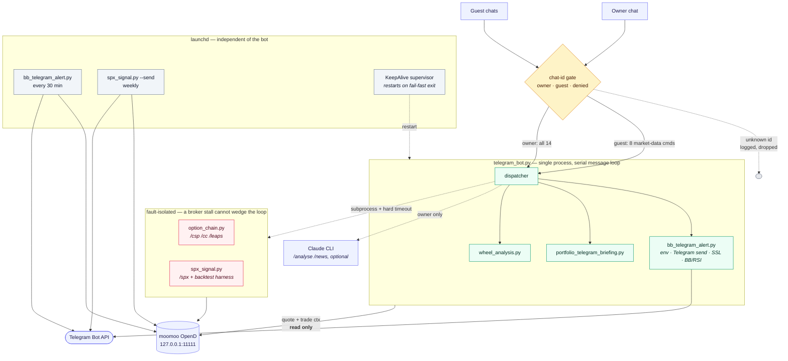

# moomoo-wheel-bot

A personal trading-automation system for an options wheel strategy: a Telegram
bot over a live brokerage account, a technical scanner across a 30-ticker
watchlist, scheduled daily reporting, and a backtesting harness.

Built for my own account against the [moomoo OpenD](https://openapi.moomoo.com/)
API. Read-only by design — **there is no order-placing code path anywhere in
this repository.**

---

## What it does

| Component | Purpose |
|---|---|
| `telegram_bot.py` | 14-command bot: positions, P&L, option chains, technicals |
| `bb_telegram_alert.py` | Bollinger/RSI scan across 30 tickers, every 30 min during market hours |
| `option_chain.py` | Chain scanner for cash-secured puts, covered calls and LEAPS |
| `spx_signal.py` | Index credit-spread entry signal with Black-Scholes strike solving |
| `wheel_analysis.py` | Entry-filter evaluation for a single ticker |
| `portfolio_telegram_briefing.py` | Daily position and risk summary |

### Bot commands

```
/portfolio /account /orders      live account (owner only)
/quote /bb /watchlist            technicals
/csp /cc /leaps /wheel           option chains, filtered by delta and DTE
/spx                             index spread signal
/analyse /news                   research
```

---

## Architecture



Three boundaries carry most of the design:

**The chat-id gate** is the only ingress. Guests reach eight market-data
commands; everything touching the account — and all free-text, which would
otherwise put the full portfolio into an LLM prompt — is owner-only. Unknown
ids are logged and dropped, which doubles as how you discover your own chat id
on first run.

**The subprocess boundary** exists because the bot handles messages serially
and the broker API blocks indefinitely on some instruments. Chain and signal
work runs in child processes under a hard timeout, so a stalled call returns an
error instead of freezing every other command.

**The supervisor boundary.** The bot exits after N consecutive poll failures
rather than retrying inside a process whose sockets are already dead, and
`launchd` restarts it. Scheduled scans run as their own processes, so the
scanner keeps working even while the bot is down.

Every path to the broker is read-only — there is no order-placing call anywhere
in the repository.

---

## The part I'd point at first

I built a backtest for an SPX put credit spread. It reported roughly
**+$892/year**. I did not believe the win rate, so I audited it and found two
defects in my own model:

1. **Expiries never settled.** The hold loop broke on the final day *before*
   reaching the settlement branch, so every trade exited at full credit.
   Losses were structurally invisible — the backtest reported a 100% win rate
   in every volatility regime, which is what gave it away.

2. **Flat implied volatility ignored skew.** Both legs were priced at one IV.
   Real chains price the further-OTM long leg *higher*, and on a 25-wide spread
   that differential is worth ~$215 — about 37% of the credit. Checked against
   a live chain, the model overstated credits by 26%.

Corrected, the same strategy returns **−$268/year**: a 93.0% win rate against a
92.8% breakeven, which is statistically indistinguishable from zero. The
apparent edge was the entire variance risk premium, handed back through skew.

I stopped trading the strategy. The harness that produced the negative result
is in `spx_signal.py`.

The general lesson is in the code now: a high win rate is not an edge. At a
12.9:1 loss-to-win ratio you need to win 92.8% of the time just to break even,
and you cannot measure your own win rate to that precision.

---

## Engineering notes

**Self-healing process supervision.** The bot once stopped responding for eight
hours while its process stayed alive. macOS power-nap cycles were killing the
long-poll socket, and the loop caught the exception and retried forever inside a
dead process, so `launchd`'s `KeepAlive` never fired. It now exits after N
consecutive poll failures and lets the supervisor restart it with fresh sockets.

**Tiered access control.** Guests get market-data commands only. Anything
touching the account — and all free-text, which otherwise reaches an LLM with
the full portfolio in its prompt — is owner-only, gated on chat id and verified
with a test table before deploy.

**Fault isolation.** Chain queries run as subprocesses with hard timeouts. The
broker API blocks indefinitely on some index ETFs, and the bot handles messages
serially, so an in-process hang would take the whole bot down.

**Data-quality guards.** Illiquid option legs print hours apart, so subtracting
two last-traded prices can be badly wrong — one spread appeared to be down $558
when it was flat. Marks are recomputed rather than trusted. Chain output also
carries an implied-vs-realised volatility ratio, which flags contracts priced
below the risk they carry (one watchlist name was quoting 67% implied against
114% realised).

---

## Setup

```bash
pip install -r requirements.txt
cp .env.example ~/.moomoo_alerts.env   # then fill it in
python3 telegram_bot.py
```

Full instructions in **[SETUP.md](SETUP.md)** — installing OpenD, picking the
right `MOOMOO_SECURITY_FIRM` for your region, finding your account id and
Telegram chat id, and the optional Claude CLI and scheduling steps.

### A note on the defaults

This is configured for one account, not as a general tool. The watchlist is a
30-ticker AI/semiconductor book; the option filters are Δ0.20–0.30 at 30–45 DTE
for short premium and Δ0.65–0.75 at 365+ DTE for LEAPS; the scanner uses
Bollinger(20) with RSI(14). Those are the parameters one person happens to
trade, not recommendations. SETUP.md lists every constant worth changing.

---

## Disclaimer

Personal project, shared as a code sample. Not investment advice, not a
product, and not intended for anyone else's money. Market data comes from a
personal OpenD entitlement and is not redistributed by this code.
