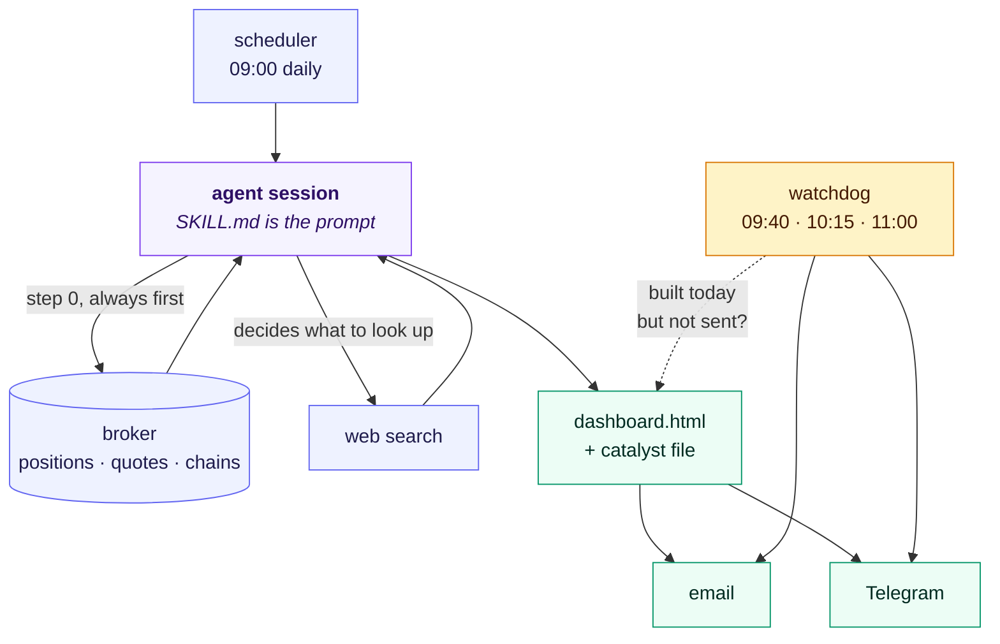

# The briefing agent

The Telegram bot is mostly deterministic Python. **This is the agentic part.**

Every morning a Claude Code session runs unattended against `SKILL.md` as its
prompt. It is not a single call — it decides what to research, runs its own
tools, produces artefacts and delivers them:

1. **Fetches live broker data first** — positions, account, quotes, chains,
   via Bash into the OpenD API. This is step 0 for a reason: web results about
   a stock are worthless if the position data underneath them is stale.
2. **Researches what it decides matters** — per-ticker news, macro and
   geopolitical risk, earnings dates, analyst moves. It chooses the searches;
   they are not a fixed list.
3. **Applies documented rules mechanically** — the Bollinger/RSI entry filter,
   volatility-adjusted strike sizing for high-vol names, a long-LEAPS time
   check, an index credit-spread signal.
4. **Renders an HTML dashboard** and writes a catalyst file the Telegram bot
   reads later, so the compact briefing carries current news.
5. **Delivers twice** — comprehensive by email, compact by Telegram — and is
   told to attempt both even if one fails.

## The loop

Two arrows carry the whole idea.

**Broker data comes back into the agent before any research happens.** That is
step 0 in the prompt, and it is ordered that way because news about a stock is
worthless if the position underneath it is stale.

**The agent decides what to search.** Nobody wrote the query list. Reading that
one holding just fell 20% is what prompts the search that explains it, which
may prompt another. That loop — act, observe, decide, act again — is the whole
difference between this and the scheduled Bollinger scan, which runs just as
automatically and decides nothing.

The watchdog is deliberately **outside** the agent. It is fixed code asking one
question on a timer, because a guard that depends on the thing it guards is not
a guard: when the agent wedged, it was the agent's own retry logic that never
ran.

## Files

| File | Purpose |
|---|---|
| `SKILL.md` | The agent's prompt. This *is* the program. |
| `send_email.py` | Delivery via the Resend API, 5 attempts, fail-fast on 4xx |
| `briefing_watchdog.py` | Catches the case where the briefing is built but never sent |

## Running it

The prompt has placeholders: `__REPO_PATH__`, `__TASK_PATH__`,
`__MOOMOO_ACC_ID__`. Delivery needs `BRIEFING_TO_EMAIL` and a Resend API key at
`~/.config/portfolio-briefing/resend_api_key.txt`.

The strategy rules inside `SKILL.md` — the watchlist, the filters, the strike
sizing — are one account's, not recommendations. See the root README.
